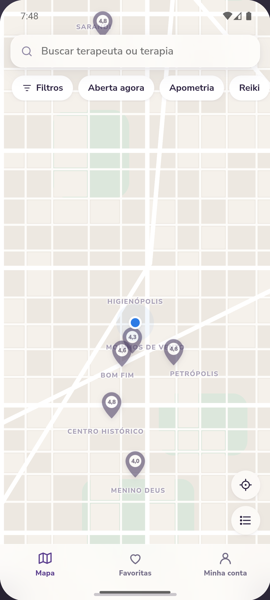
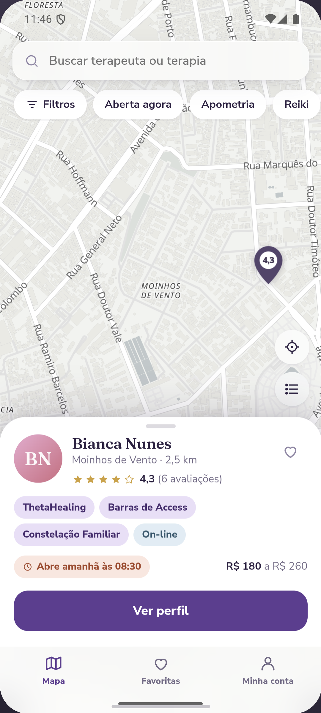

# 🪷 Mapa Holístico

Um mapa vivo das terapias holísticas. Você abre, permite a localização, e vê quem
atende **perto de você** — com valores claros, horário de atendimento e avaliação
de quem já foi.

**[▶ Abrir o protótipo](https://skotalexsander.github.io/lotus/)** — roda no
navegador, sem instalar nada e sem internet depois de carregar.

- **iPhone:** abra o endereço acima no **Safari** → Compartilhar → *Adicionar à
  Tela de Início*. Abre em tela cheia, com ícone próprio.
- **Android:** dá para fazer o mesmo pelo Chrome, ou instalar o aplicativo:
  **[baixar o APK](https://github.com/SkotAlexsander/lotus/releases/latest/download/mapa-holistico.apk)**
  (o Android vai avisar que é de fonte desconhecida — é o esperado para aplicativo
  que não veio da Play Store; ele não pede nenhuma permissão e não acessa a rede).

<p align="center">
  
  
  
</p>

---

## O problema

Quem procura Apometria, Reiki ou ThetaHealing hoje depende de indicação de amiga ou
de perfil perdido no Instagram. Não existe um lugar que responda a pergunta simples:
**quem atende perto de mim, quanto custa, é confiável, e está atendendo agora?**

Do outro lado, terapeuta recém-formada não tem como ser encontrada nem como
construir reputação.

## Os dois lados

**Quem procura** vê o mapa da própria região, filtra por tipo de terapia, preço e
avaliação, toca num pino, lê o perfil inteiro — serviços com valor, horários com
selo de *aberta agora*, avaliações com resposta da terapeuta — e chama no WhatsApp.

**Quem atende** monta o perfil em seis passos, marca no mapa onde atende (podendo
mostrar só o bairro), define serviços e valores, horários, e passa a aparecer para
as clientes da região. Responde avaliações e acompanha um painel simples.

---

## Estado: protótipo navegável

Isto é a **Fase 0**: o app inteiro navegável, com **dados fictícios**, para validar
telas e fluxo antes de escrever o produto final. Nada é real — as 12 terapeutas são
ficção, nada sai do aparelho e nada fica gravado.

| | |
|---|---|
| 16 telas | os dois lados completos, do cadastro ao painel |
| 1 arquivo | HTML auto-contido, roda **offline** — fontes embutidas, mapa desenhado por código |
| 64 provas | em navegador real: fluxos, contraste, área de toque, 320 px, movimento reduzido |
| Android | APK instalável, provado em emulador |
| Banco | SQL completo para Supabase + PostGIS, com RLS |

---

## Como foi feito

Um único arquivo HTML, sem framework e sem dependência externa. A razão é prática:
o protótipo precisa abrir com duplo clique, funcionar sem internet e caber num link
que se manda para uma terapeuta testar no celular dela.

**A física do movimento é levada a sério.** Nada de transição de duração fixa: cada
gesto é uma mola interrompível, que parte do valor que está na tela, herda a
velocidade do dedo e projeta o momento para onde ele estava mandando a coisa. É o
que faz o mapa, a folha e o gesto de voltar responderem como objeto e não como
página.

```
src/                  onde se edita — a numeração é a ORDEM DE CARGA
  00-molde.html         esqueleto e tela de abertura
  01-estilo.css         design system: tokens → materiais → componentes
  02-fisica.js          molas, momento, rubber-band, rastreio de velocidade
  03-dados.js           as 12 terapeutas — fonte única, usada também pelo banco
  04-mapa.js            traçado urbano por código + gestos do mapa
  05-telas.js           o HTML de cada tela
  06-app.js             roteador, eventos, navegação

montar.js             src/ → index.html
banco/                o SQL do Supabase (ver banco/README.md)
android/              projeto Android escrito à mão
teste/bancada.js      as 64 provas
```

### Rodar

```bash
node montar.js                # src/ → index.html
node teste/bancada.js         # as 64 provas (precisa de Playwright)
node banco/conferir.js        # 10 provas estáticas do SQL
python android/montar_apk.py  # compila o APK (precisa de Android SDK + JDK 17–23)
```

---

## O que ainda não é real

| Hoje | No MVP |
|---|---|
| Login aceita qualquer coisa | Supabase Auth: Google e código por celular |
| Localização fixa | localização do aparelho, com escolha de cidade como plano B |
| Mapa desenhado por código | MapLibre + OpenStreetMap |
| 12 terapeutas num arquivo JS | Postgres + PostGIS, busca por raio |
| Favoritas e avaliações somem ao recarregar | gravadas no banco, com RLS |

O SQL do banco já está escrito e conferido em [`banco/`](banco/) — inclusive as
políticas de acesso linha a linha, a função de busca por proximidade e o
mascaramento de endereço de quem escolhe mostrar só o bairro.

---

## Licença

MIT — veja [LICENSE](LICENSE).

As terapeutas, avaliações, endereços e telefones deste protótipo são **fictícios**.
Qualquer semelhança é coincidência.
